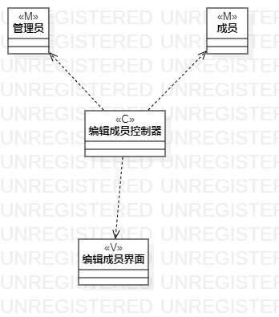

# 实验四五：类建模

## 一、实验目标

1. 掌握类建模方法
2. 掌握类图的画法
3. 了解MVC设计模式

## 二、实验内容

1. 根据实验二的用例规约设计类。

2. 基于MVC设计模式画出类图

## 三、实验步骤

1. 观看老师所讲解的视屏
2. 根据用例规约画出该有的界面，控制器，类
3. 建立他们之间的关系

## 四、实验结果

图1：添加成员类图

图2： 编辑成员类图

图3：删除成员类图

