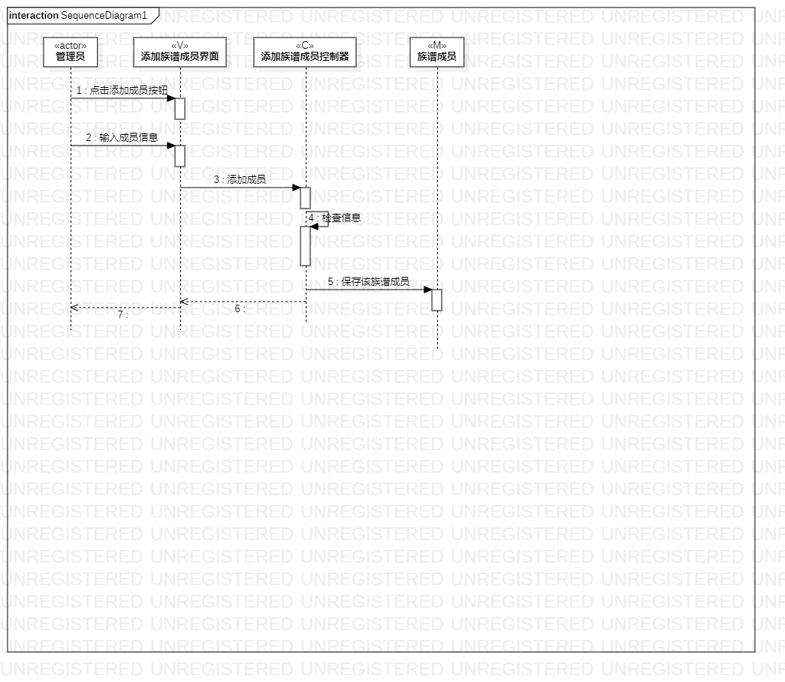
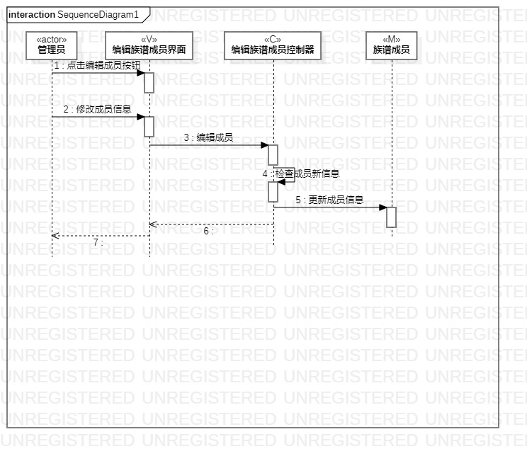
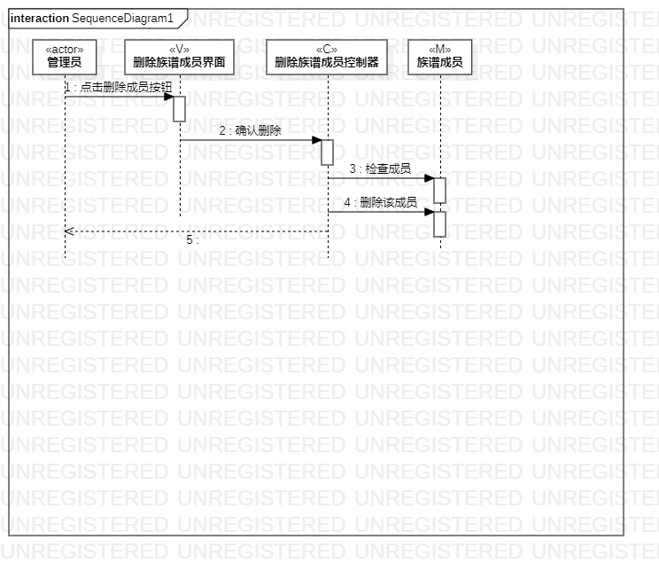

# 实验六

## 一、实验目标

1. 理解系统交互
2. 掌握UML顺序图的画法
3. 理解对象交互的定义与建模方法

## 二、实验内容

1. 学习交互建模知识
2. 画顺序图

## 三、实验步骤

1. 观看老师发布的教学视屏
2. 根据以往画的用例模型和类模型，确定功能所需要的系统对象
3. 画出顺序图

## 四、实验结果

图1：添加族谱成员的顺序图

图2：编辑族谱成员的顺序图

图3：删除族谱成员的顺序图

