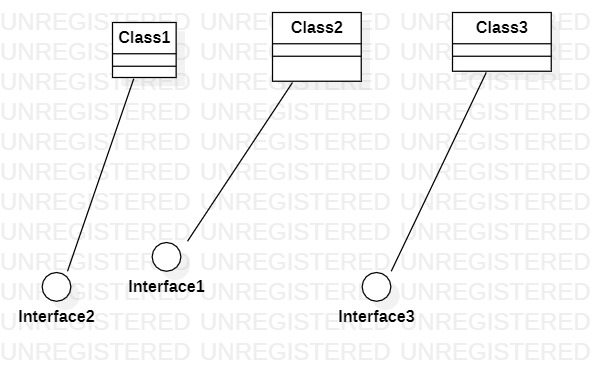

# 实验一    

## 一、实验目标

1.熟悉GitHub实验过程
2.安装与使用StarUML

## 二、实验内容

- 安装GitHub并练习使用Git Bash
- 安装StarUML并创建一个图

## 三、实验结果

- 1.使用Git Bash的clone指令克隆代码到本地磁盘
- 2.使用StarUML创建第一个图
- 3.使用Git Bash的add、commit、push指令将图片送到github的库
- 4.使用github在线编辑实验报告，并插入当前目录下的实验结果图片
- 5.使用pull requests将库的实验传送到老师的库中
 ## 四、实验结果

 1.画图

图1.在StarUML上创建的第一个图
