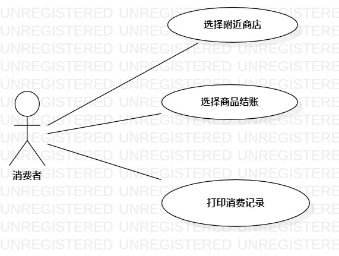

# 实验2：用例建模

## 一、实验目的

1.创建并完善选题

2.了解并掌握用例图的画法

3.通过github提交实验文档

## 二、实验内容

1.建立个人选题项目

2.根据自己的项目运用UMLStar绘制用例图

3.用git操作提交本次实验

## 三、实验步骤

1.确立系统的功能(UseCase)
 - 选择附近店家
 - 选择商品结账
 - 打印消费记录

 2.根据功能建立Use Case
 确立系统的扮演者（Actor）
 - 消费者
  
 3.建立之间的联系（Association）

 4.编写用例规约
 
## 四、实验结果

 图1:外卖系统用例图

# 用例规约的编写

## 表1：选择附近店家用例1规约  

用例编号  | UC01 | 备注  
-|:-|-  
用例名称  | 选择附近店家  |   
前置条件  |  登录系统成功    |   
后置条件  |      |   
基本流程  | 1.消费者在页面选择或填写收货地址  |*用例执行成功的步骤*    
~| 2.消费者点击搜索按钮  | 
~| 3.系统检测地址信息填写有效，提示“正在跳转到附近店家页面”  |
~| 4.系统查询附近的店家后，跳转到附近店家的页面  |   
扩展流程  | 3.1  系统检测填写地址信息为空，提示“收获地址不能为空” |*用例执行失败*    

## 表2：选择商品结账用例2规约  

用例编号  | UC02 | 备注  
-|:-|-  
用例名称  | 选择商品结账  |   
前置条件  | 收货地址填写有效     |    
后置条件  |      |   
基本流程  | 1.消费者选择店家 |*用例执行成功的步骤*    
~|2.系统跳到店家页面  |   
~|3.消费者选择商品  |   
~|4.系统检测该商品未售罄，提示“选择成功” |
~|5.消费者点击结账按钮 |
~|6.系统检测消费者的选择不为空，保存消费者的选择，提示“结账成功” |
扩展流程  | 4.1系统检测商品已售罄，提示“该商品已售罄”  |*用例执行失败* 
~|6.1系统检测消费者的选择为空，提示“未选择任何商品”  |

