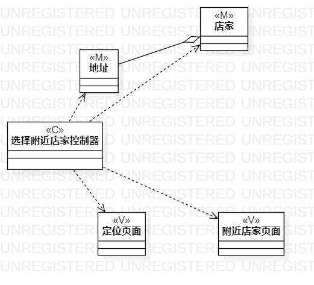
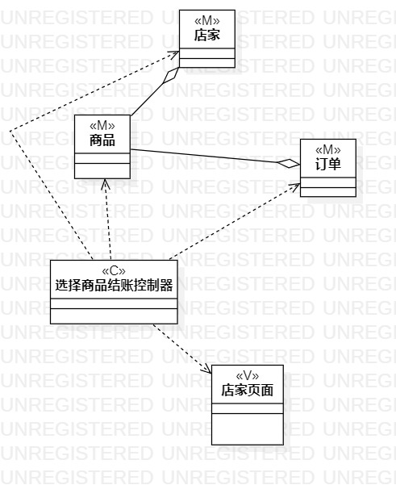

# 实验六：交互建模

### 一、实验目标
    1.理解系统交互；
    2.掌握UML顺序图的画法；
    3.掌握对象交互的定义与建模方法。

### 二、实验内容
    1.根据用例模型和类模型，确定功能所涉及的系统对象；
    2.在顺序图上画出参与者（对象）；
    3.在顺序图上画出消息（交互）
       
 ### 三、实验步骤
     1.根据实验二的用例规约画出相应的类图
     2.在用例规约中找出类的实体、模型、和控制器
     3.根据找出的实体、模型和控制器，用StarUML画出实体类、模型类和控制器类。
     4.使用Dependency把所有类和控制器连起来
     5.使用Aggregation把相关的实体类连起来。
     
     
     

### 四、实验结果

  
  
  
  
  
  图1.选择附近店家的类图
  
  
  
  
  
  
  
  图2.选择商品结账的类图
  
  
