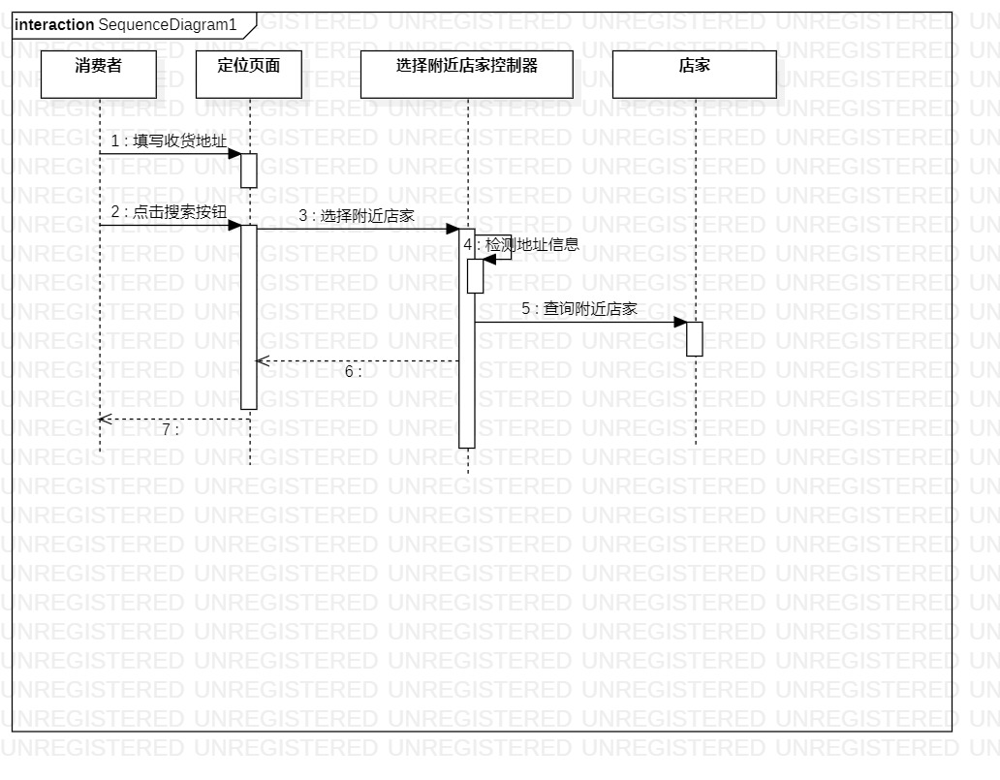
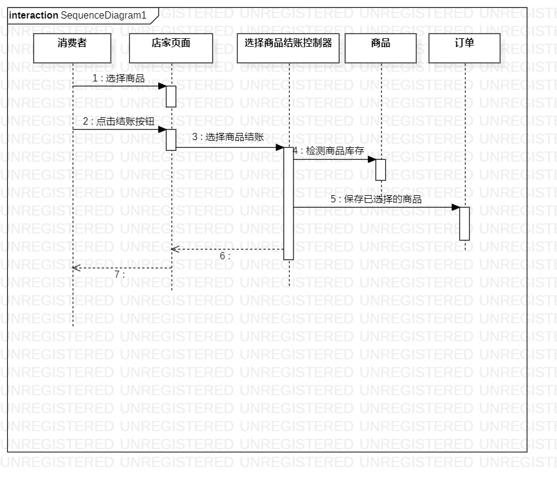

# 实验六：对象交互建模

### 一、实验目标
    1.理解系统交互；
    2.掌握UML顺序图的画法；
    3.掌握对象交互的定义与建模方法。

### 二、实验内容
    1.根据用例模型和类模型，确定功能所涉及的系统对象；
    2.在顺序图上画出参与者（对象）；
    3.在顺序图上画出消息（交互）
       
 ### 三、实验步骤
     1.根据实验四和实验五的类图画找出第一个参与者
     2.再从类图中找出1+N个参与者
     3.根据用例规约，使用消息箭头画出顺序图
  
     
     
     

### 四、实验结果

  
  
  
  
  
  图1.选择附近店家的顺序图
  
  
  
  
  
  
  
  图2.选择商品结账的顺序图
  
  
