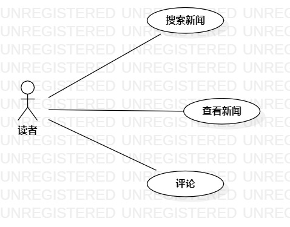

# 实验二：用例建模

## 一、实验目标
- 学习用例建模
## 二、实验内容
1. 确定个人建模选题，将选题填写在 Issues 中：
https://github.com/hzuapps/uml-modeling-2020/issues
2. 细化功能需求
3. 画出用例图（Use Case Diagram）
4. 编写用例规约
## 三、实验步骤
1. 在 https://github.com/hzuapps/uml-modeling-2020/issues 上提交个人选题
2. 使用 StarUML 画选题的用例图
3. 编写用例规约
## 四、实验结果
选题：科技新闻阅览网页（#475）
1. 查看新闻：显示新闻详情（包括新闻内容、相关新闻推荐、新闻评论）
2. 搜索新闻：使用关键词检索新闻标题，找到相应的新闻
3. 评论新闻：在每条新闻下方有一个评论区，读者可以在评论区看到其他人对该条新闻的评论，也可在此发表自己对该条新闻的评论

  
图1：科技新闻集锦用例图

## 五、用例规约
### 表1：查看新闻用例规约  

用例编号  | UC01 | 备注  
-|:-|-  
用例名称  | 查看新闻 |   
前置条件  |  |    
后置条件  | 页面显示新闻详情 |    
基本流程  | 1. 读者点击新闻链接 |   
~| 2. 系统查询新闻内容 | 
~| 3. 页面显示新闻内容 |
扩展流程  | 2.1 系统检查发现新闻数据不存在，返回新闻列表，提示“链接无效” | 新闻数据被系统删除

### 表2：搜索新闻用例规约  

用例编号  | UC02 | 备注  
-|:-|-  
用例名称  | 搜索新闻 |   
前置条件  |  |    
后置条件  | 页面显示匹配到的新闻列表 |    
基本流程  | 1. 读者输入关键词，点击搜索按钮 |    
~| 2. 系统检查输入内容 |
~| 3. 系统查询到含有关键词的新闻数据 |   
~| 4. 页面显示搜索结果 |
扩展流程  | 2.1 系统检查发现输入内容为空，提示“搜索内容不能为空”，返回流程1 |

### 表3：评论新闻用例规约  

用例编号  | UC03 | 备注  
-|:-|-  
用例名称  | 评论新闻 |   
前置条件  | 读者已登录 |
后置条件  | 评论区显示读者发表的评论 |    
基本流程  | 1. 读者输入评论内容，点击“发表评论”按钮 |
~| 2. 系统检查评论内容 |
~| 3. 系统保存评论内容，提示“评论成功” |
~| 4. 页面显示读者发表的评论 |   
扩展流程  | 2.1 系统发现评论内容为空，提示“评论内容不能为空”，返回流程1 |