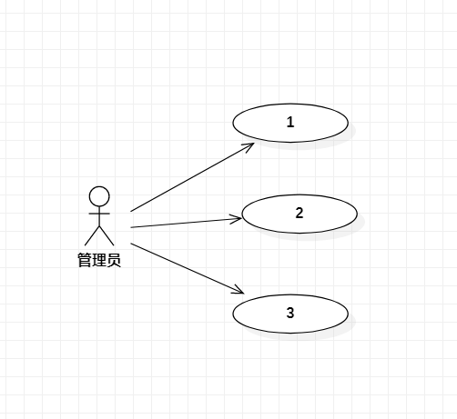

# 实验一

## 实验目标
- 熟悉Github实验过程
- 安装与使用StarUML

## 实验内容
- 安装Github并练习使用Git Bash
- 安装StarUML并创建一个图

## 实验步骤
- 下载课程相关软件（git工具及StarUML软件）
- 在github上fork项目后，clone到本地磁盘
- 创建实验文档，用StarUML创建一个图，保存为jpg格式
- 用Git Bash push到Github上
- 在Github上编辑Markdown文档，并插入当前目录下的model1.jpg
- pull request,请求合并到主仓库

## 实验结果

1.画图  
  
图1.在StarUML上创建的第一个图
