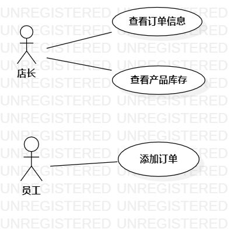

# 实验二：用例建模

## 一、实验目标
1. 使用Markdown编写报告
2. 细化选题
3. 学习使用StarUML用例建模

## 二、实验内容
1. 创建用例图
2. 编写实验报告文档
3. 编写用例规约

## 三、实验步骤
1. 确定选题：服装店销售系统
2. 确定用户：店长
3. 确定功能：
   - 添加订单：店长输入客户姓名、商品名称及购买数量，即可添加订单
   - 查看商品库存：店长输入商品名称即可查看指定商品库存信息
   - 查看订单信息：店长输入客户姓名即可查看指定订单信息
4. 建立用户和用例之间的联系
5. 绘画用例图(Lab2_UseCaseDiagram)，保存为jpg格式
6. 编写用例规约

## 四、实验结果

1. 画用例图  
  
图1：服装店销售系统的用例图
2. 编写用例规约
## 表1：添加订单用例规约  

用例编号  | UC01 | 备注  
-|:-|-  
用例名称  | 添加订单  |   
前置条件  | 店长登录进入服装店销售系统首页     | *可选*   
后置条件  |      | *可选*   
基本流程  | 1. 店长输入订单信息，点击提交按钮；  |*用例执行成功的步骤*      
~| 2. 系统查询商品信息，检查发现购买数量小于或等于库存量，保存订单信息；  |   
~| 3. 系统显示添加订单成功页面。  |  
扩展流程  | 2.1 系统检查发现购买数量大于库存量，提示“商品库存不足”。  |*用例执行失败*    

## 表2：查看商品库存用例规约  

用例编号  | UC02 | 备注  
-|:-|-  
用例名称  | 查看商品库存  |   
前置条件  | 店长登录进入服装店销售系统首页     | *可选*   
后置条件  |      | *可选*   
基本流程  | 1. 店长输入商品名称，点击提交按钮 ；  |*用例执行成功的步骤*       
~| 2. 系统检查发现商品名称非空，查询商品信息；  |   
~| 3. 系统显示商品库存信息页面。  |  
扩展流程  | 2.1 系统检查发现商品名称为空，提示“商品名称不能为空”。  |*用例执行失败*   

## 表3：查看订单用例规约  

用例编号  | UC03 | 备注  
-|:-|-  
用例名称  | 查看订单  |   
前置条件  | 店长登录进入服装店销售系统首页     | *可选*   
后置条件  |      | *可选*   
基本流程  | 1. 店长输入客户姓名，点击提交按钮；  |*用例执行成功的步骤*    
~| 2. 系统检查发现客户姓名非空，查询订单信息；  |   
~| 3. 系统显示订单信息页面。  |  
扩展流程  | 2.1 系统检查发现客户姓名为空，提示“客户姓名不能为空”。  |*用例执行失败*   
