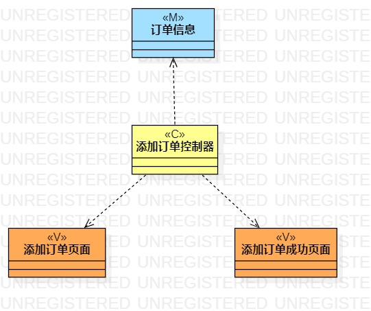
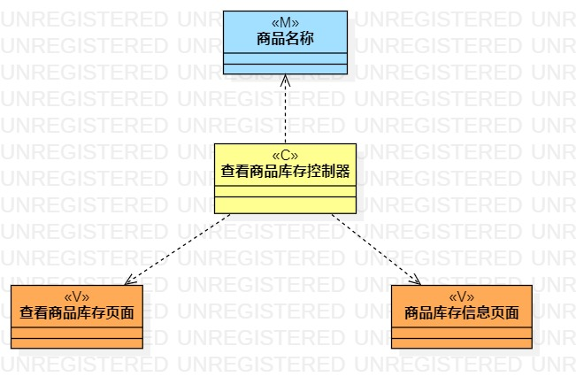
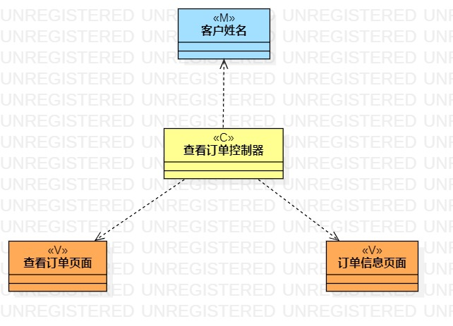

# 实验四五：类建模

## 一、实验目标
1. 掌握类建模方法
2. 了解MVC的设计模式
3. 掌握类图的画法（Class Diagram）
4. 理解类的5种关系

## 二、实验内容
1. 根据用例规约创建类图

## 三、实验步骤
1. 了解MVC设计模式
2. 根据MVC设计模式创建“添加订单”用例类图
3. 根据MVC设计模式创建“查看商品库存”用例类图
4. 根据MVC设计模式创建“查看订单”用例类图

## 四、实验结果
  
图1.添加订单用例的类图

  
图2.查看商品库存用例的类图

  
图3.查看订单用例的类图
