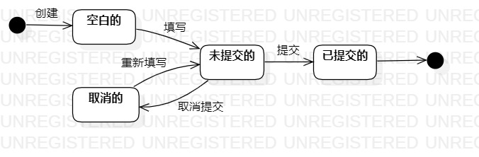

# 实验七

## 一、实验目标

1. 掌握状态图及其画法（状态图，Statechart）

## 二、实验内容

1. 学习并理解状态图的定义
2. 根据所选的主题绘制状态图

## 三、实验步骤

1. 寻找关键对象 ：订单

2. 设计该对象的关键状态：
  - 草稿的  
  - 未添加的  
  - 取消的  
  - 已添加的  

3. 描述状态间的转变条件

## 四、实验结果

  
图1：订单的状态图
