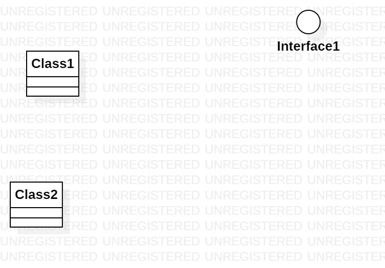

# 实验一

## 一、实验目标
1.熟悉使用GitHub

2.熟悉使用StartUML

## 二、实验内容
1.安装GitHub并练习使用Git Bash

2.安装StartUML并创建一个图

## 三、实验步骤

1.下载并安装Git和StartUML

2.fork项目到个人仓库

3.clone项目到本地磁盘

4.在students文件夹下新增个人学号文件夹

5.在个人学号文件夹下创建UML图和Markdown实验文档

6.使用git push上传修改到个人仓库

7.使用git pull同步仓库内容

8.发起pull request，同步修改到主库

## 四、实验结果

1.StarUML软件截图

图1：第一个UML图
