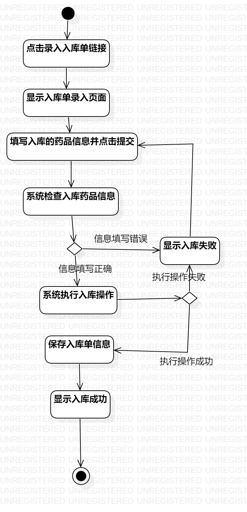
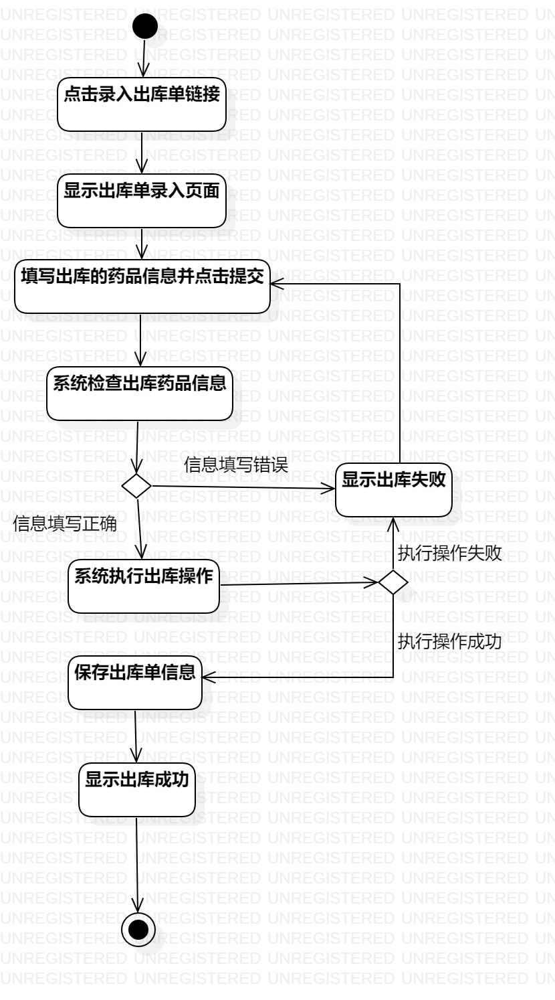

# 实验3：过程建模

## 一、实验目标

1.掌握过程建模方法。

2.掌握活动图的画法。（Activity Diagram）

## 二、实验内容

1.根据用例规约图创建活动图

## 三、实验步骤

1.画活动图1(Lab3_ActivityDiagram1)/活动图2(Lab3_ActivityDiagram2)

2.添加Initial和Final

3.根据用例规约添加Action、Decision、Merge

4.最后用Control Flow将以上建立的元素相连

## 四、实验结果

图1:录入入库单活动图

图2:录入出库单活动图
