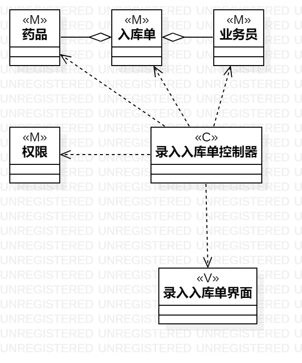
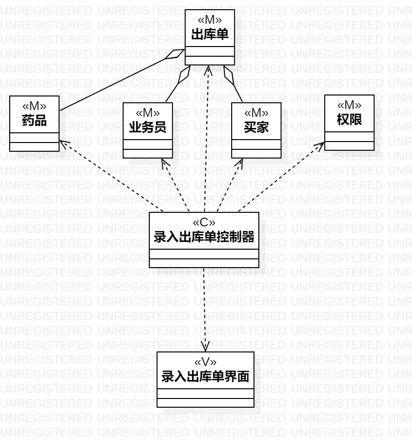

# 实验四五：类建模

## 一、实验目标

1.掌握类建模方法。

2.掌握类图的画法。（Class Diagram）

3.了解MVC设计模式。

## 二、实验内容

1.根据用例规约图中的基本流程和扩展流程设计类。

2.基于MVC设计模式画出类图。

## 三、实验步骤

1.画类图1(Lab3_ClassDiagram1)/类图2(Lab3_ClassDiagram2)。

2.根据用例规约添加多个Class。

3.为每个Class加上name和stereotype。

4.给每个类建立关系。

## 四、实验结果

图1:录入入库单类图

图2:录入出库单类图
