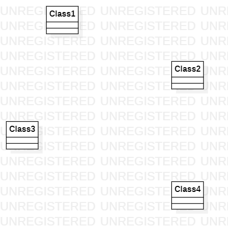

# 实验一

## 一、实验目标
1.掌握starUML建模工具的使用；  
2.了解如何GitHub并下载工具； 
## 二、实验内容
1.下载starUML并且学会如何使用  
2.下载GitHub工具，然后学会如何使用对应的指令  
## 3、实验步骤   
1.下载starUML和Git软件；  
2.创建GitHUb账号并且Fork项目到自己的库；  
3.克隆GitHub库到本地磁盘；  
4.在本地库里创建以学号为目录的文件夹；    
5.在学号目录里创建实验一文档；  
6.用starUML画第一张UML图并保存与学号目录下；  
7.用Git将新建文档及图片传到GitHub；  
## 四、实验结果
第一张UML图  
  
图1
