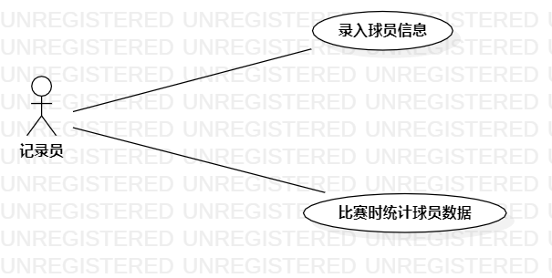

# 实验2 用例建模

## 一、实验目标
1.使用Markdown编写报告  
2. 细化选题  
3. 学习使用StarUML用例建模  

## 二、实验内容
1. 用StarUML创建用例图  
2. 用Markdown编写实验报告文档  
3. 根据选题编写用例规约  

## 三、实验内容
1.确定选题为篮球比赛统计系统； 

2.根据选题内容在StarUML上创建符合题意的用例图；  
    2.1.参与者-记录员  
    2.2.示例-记录球员信息  
            -统计各个球员数据  
          
 2.3.通过题意建立参与员与示例之间的联系  
 
 3.编写用例规约

## 四、实验结果
1.画图  
    
篮球比赛统计系统用例图  

## 表1：录入球员信息用例规约  

用例编号  | UC01 | 备注  
-|:-|-  
用例名称  | 录入球员信息  |   
前置条件  |  球员在比赛名单中    |      
后置条件  |  球员符合参赛要求    |     
基本流程  | 1.记录员将比赛球员信息录入  |*用例执行成功的步骤*    
~| 2.所有参赛球员信息将显示在大屏幕上  |   
~| 3. 系统对球员身份进行核对  |     
扩展流程  | 3.1.发现球员身份错误   |*用例执行失败*    

## 表2：统计球员数据用例规约  

用例编号  | UC02 | 备注  
-|:-|-  
用例名称  | 统计球员数据  |   
前置条件  | 球员上场比赛     | *可选*   
后置条件  | 记录员正确统计数据     | *可选*   
基本流程  | 1.记录员将场上球员的数据进行统计  |*用例执行成功的步骤*    
~| 2.各个球员的比赛数据将一一对应  |   
~| 3.数据显示在大屏幕上   |   
~| 4.系统根据数据计算球员效率  |   
扩展流程  | 3.1.系统数据与球员数据不匹配   |*用例执行失败*    

  
