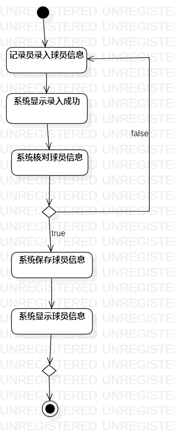
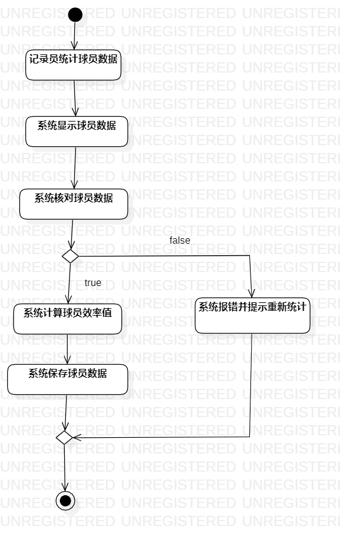

# 实验三：过程建模  

## 一、实验目标  

1.掌握过程建模方法  
2.掌握活动图（Activity Diagram）的画法  

## 二、实验内容  

1.学习过程建模的概念  
2.根据用例规约画出活动图  

## 三、实验步骤  
1、学习了解过程建模相关知识；  
2、根据用例规约创建活动图：  
——在StarUML上创建一个活动图；  
——以一个圆形作为活动图开头；  
——根据用例规约上的步骤创建相对于的活动图形；  
——用带箭头实线将前后活动图形连接；  
——最后以结束图形结尾；  
3、将所有的活动图转为图片形式并保存与学号文件夹下；  
4、在GitHub上完成实验报告；  

## 四、实验结果  
   
图1：记录员录入球员信息活动图  
  
图2：统计球员数据活动图  

## 实验心得  
此次实验为过程建模，是继上次用例建模之后的一个过程化建模实验，在学习完老师发布的视频，了解了过程建模的重点后，根据自己所选题目要求，按照上次实验的用例规约创建相对于的活动图，此次实验是比较重要的，对自己所要开发系统的过程化深入了解，即自己所开发系统的需求以及即将遇到的问题都能在本次实验中提前有所了解，最后在完成活动图的时候由于自己考虑欠缺，老师给予了非常重要的建议跟改进，也希望可以在此次实验后，自己对过程化建模有所进步。
