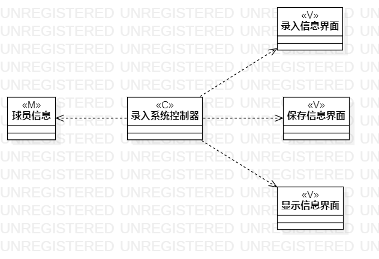
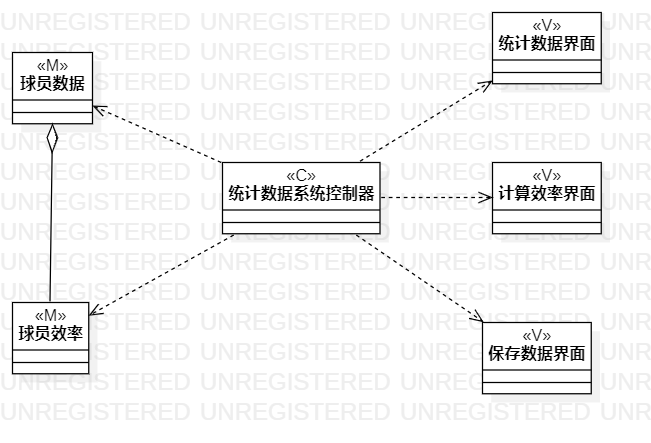

# 实验四、五：（高级）类建模

## 一、实验目标 
1、掌握类建模方法；  
2、了解MVC或你熟悉的设计模式；  
3、掌握类图的画法。（Class Diagram）  

## 二、实验内容  
1、基于MVC模式设计类；  
2、设计类的关系；  
3、画出类图。  

## 三、实验步骤  
1、在StarUML上创建一个录入球员信息的类图模型；  
2、参考MVC模型在类图上创建录入信息控制器、球员信息、录入界面等相关类；  
3、根据它们之间的关系用对应的线连接类；  
4、再创建一个新的统计数据类图；  
5、在类图上创建统计数据控制器、统计界面、球员数据等相关类；  
6、用对应关系线连接两个类；  
7、将画好的类图导出保存本地学号文件夹；  
8、咋GitHub上Marddown实验文档并提交；  

## 四、实验结果  
  
图1：录入球员信息类图  
  
图2：统计球员数据类图
