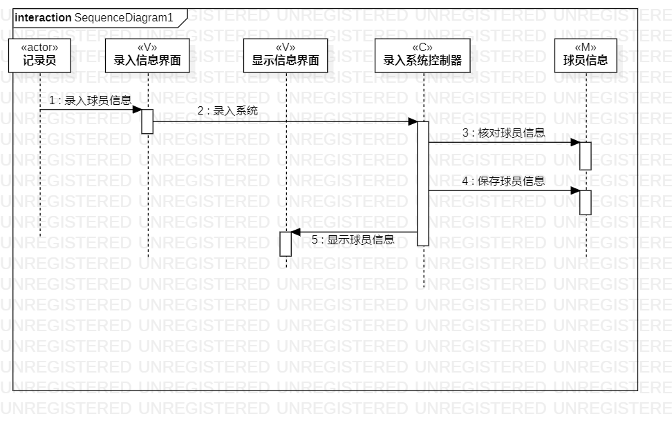

# 实验六：交互建模

## 一、实验目标 
1、理解系统交互  
2、掌握UML顺序图的画法  
3、掌握对象交互的定义与建模方法  

## 二、实验内容  
1、根据用例模型和类模型，确定功能所涉及的系统对象；  
2、在顺序图上画出参与者（对象）；  
3、在顺序图上画出消息（交互）；  

## 三、实验步骤  
1、根据自己选题创建对应的顺序图；  
2、查看自己的类图确定N+1个参与者；  
3、参与者之间根据活动图的先后执行顺序连线；  
4、将画好的顺序图以图片的形式导出；  
5、根据实验要求完成实验；  

## 四、实验结果  
  
图1：记录员录入球员信息顺序图  
  
图2：记录员统计球员数据顺序图
