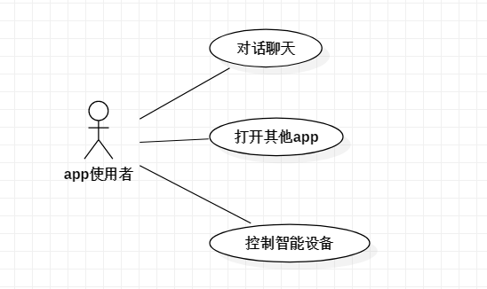

# 实验二：用例建模

## 1、实验目标
 
-确定选题和功能需求

-掌握用例图画法

-掌握编写用例规约

## 2、实验内容

-修改实验1报告

-确定选题并创建用例图

-编写实验文档

-编写用例规约

## 3、实验步骤

-选题为Siri语音助手

-根据选题在StarUML上创建用例图（model2）

-编写三个用例规例

## 4、实验结果

-画图

图1：Siri语音助手的用例图

## 表1：对话聊天用例规约  

 用例编号   | 001 | 备注  
  -|:-|- 
 用例名称   | 对话聊天 |   
 前置条件   |    打开Siri |   
 后置条件   |   无  |   
 基本流程   | 1.	使用者询问系统；  |  
 ~| 2. 系统将语音转化为文本；  |   
 ~| 3.	系统查询数据库并匹配相关的回答；  |   
 ~| 4. 系统返回匹配答案；  |   
 ~| 5. 系统显示答案。  |  *用例执行成功*
 扩展流程  | 3.1	系统查询数据库发现没有匹配的问题，提示使用者“Siri无法回答该问题，请重新提问！”|  *用例执行失败* 
 ~|4.1 系统查询数据库发现没有匹配的答案，提示使用者“Siri无法回答该问题，请重新提问！”|  *用例执行失败* 
 
 
 ## 表2：打开其他app用例规约  

 用例编号  | 002| 备注  
 -|:-|-  
 用例名称  | 打开其他app  |   
 前置条件  |  打开Siri  |   
 后置条件  |   无 | 
 基本流程  | 1. 使用者说出“打开xx应用”的请求；  |    
 ~| 2. 系统查看手机应用；  |   
 ~| 3. 系统提示用户app打开情况；  |   
 ~| 4. 系统打开用户指定的应用app，提示“将为您打开xx应用app”。  |  *用例执行成功* 
 扩展流程  |4.1	若未发现用户指定的应用app则提示用户手机无此应用app。 | *用例执行失败*   
 
 
 ## 表3：控制智能设备用例规约  

 用例编号  |003 | 备注  
 -|:-|-  
 用例名称  | 控制智能设备  |   
 前置条件  | 打开Siri   |    
 后置条件  |  无   |   
 基本流程  |1.	使用者说出控制智能设备的相关请求；  |
 ~| 2.	系统检查智能设备连接情况； |   
 ~| 3.	系统控制相关的智能设备； | *用例执行成功*    
 ~| 4.	系统提示控制智能设备情况。  |  
 扩展流程  | 3.1 使用者向系统请求控制的某智能设备未连接或不存在，则提示使用者无法控制。  |*用例执行失败* 

