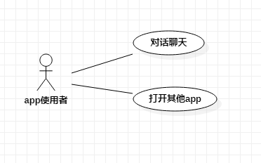

# 实验二：用例建模

## 1、实验目标
 
-确定选题和功能需求

-掌握用例图画法

-掌握编写用例规约

## 2、实验内容

-确定选题：Siri语音助手

-功能需求描述：

（1）对话聊天：使用者通过说出“Hey,Siri”唤醒语音助手，然后跟Siri进行智能化的人机对话。用户向Siri提出问题，Siri识别后将问题以文字的形式输出到屏幕上，并将此内容传输到数据库进行匹配，最后Siri以语音的形式回复用户，并以文字的形式将回复的内容展示在屏幕上。

（2）打开其他app：需要打开某应用程序的用户通过向Siri说出“Siri，打开xx应用”，Siri响应并打开用户指定的应用程序，并可通过Siri实现某些应用程序的功能，例如“播放音乐”、“打电话”等功能。

-编写实验文档

-编写用例规约

## 3、实验步骤

-选题为Siri语音助手

-根据选题在StarUML上创建用例图（Lab2_UseCaseDiagram.jpg）

-编写三个用例规例

## 4、实验结果

-画图

图1：Siri语音助手的用例图

## 表1：对话聊天用例规约  

用例编号  | 001| 备注  
 -|:-|-  
 用例名称  | 对话聊天  |   
 前置条件  |  打开Siri  |   
 后置条件  |   Siri回答使用者完成对话 | 
 基本流程  |  1.	使用者询问系统；  |    
 ~| 2. 系统将语音转化为文本；  |   
 ~| 3.	系统查询数据库并匹配相关的回答；  |   
 ~| 4. 系统返回匹配答案；  |  
 ~|  5. 系统显示答案。  |  *用例执行成功*
 扩展流程  |3.1	系统发现没有匹配的问题，提示使用者“无法回答，请重新提问！” | *用例执行失败* 
 ~|4.1 系统发现没有匹配的答案，提示使用者“无法回答，请重新提问！”|  *用例执行失败*
 
 ## 表2：打开其他app用例规约  

 用例编号  | 002| 备注  
 -|:-|-  
 用例名称  | 打开其他app  |   
 前置条件  |  打开Siri  |   
 后置条件  |   Siri为使用者打开应用app | 
 基本流程  | 1. 使用者说出“打开xx应用”的请求；  |    
 ~| 2. 系统查看手机应用；  |   
 ~| 3. 系统提示用户app打开情况；  |   
 ~| 4. 系统打开用户指定的应用app，提示“将为您打开xx应用app”。  |  *用例执行成功* 
 扩展流程  |4.1	若未发现用户指定的应用app则提示用户手机无此应用app。 | *用例执行失败*   
 
 
 
