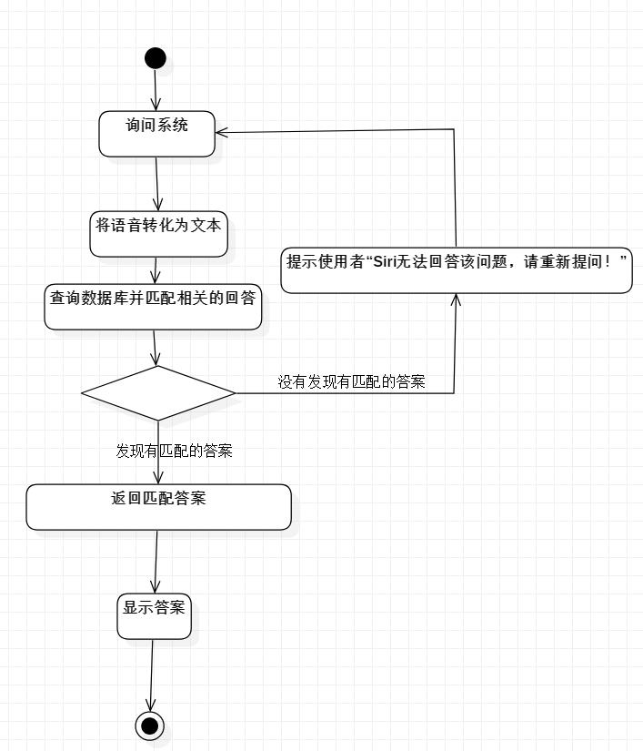
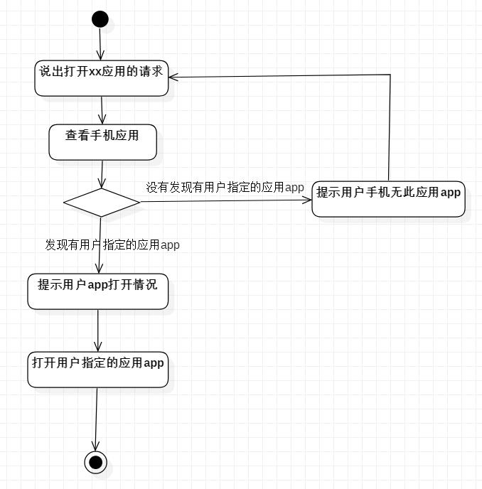

# 实验三：过程建模

## 一、实验目标
1. 掌握过程建模方法；
2. 掌握活动图的画法（Activity Diagram）。
## 二、实验内容
1. 使用StarUML根据实验二中编写的用例规约创建活动图
## 三、实验步骤
1. 修改实验二的用例规约
1. 新建活动图（Add Diagram -> Activity Diagram）
3. 添加initial和final
4. 根据用例规约添加action和decision
5. 将绘制的活动图导出为.jpg图片
## 四、实验结果
  
图1：001对话聊天用例图

  
图2：002打开其他app用例图

