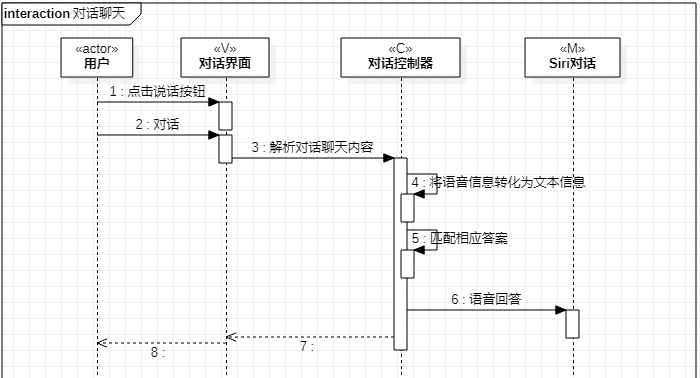
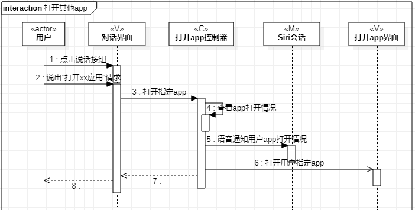

# 实验六：交互建模
## 一、实验目标
1. 理解系统交互
2. 掌握UML顺序图的画法
3. 掌握对象交互的定义与建模方法
## 二、实验内容
1. 根据用例模型和类模型，确定功能所涉及的系统对象
2. 在顺序图上画出参与者（对象）
3. 在顺序图上画出消息（交互）
## 三、实验步骤
1. 新建顺序图（Add Diagram -> Sequence Diagram）
2. 根据实验四的类图画出对象（Lifeline）
3. 根据实验三的活动图画出交互（Message）
## 四、实验结果
  
图1：对话聊天用例顺序图

  
图2：打开其他app用例顺序图
