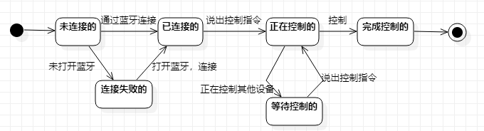

# 实验七：状态建模

## 一、实验目标

1. 掌握对象状态建模（Statechart）

## 二、实验内容

1. 根据用例图、活动图、类图、时序图来绘画状态图;

2. 编写实验报告文档。

## 三、实验步骤

### 实验步骤

1. 在StarUML上创建试卷状态图（StatechartDiagram.jpg）;
2. 根据系统中智能设备，找出它的状态;
3. 智能设备在系统中状态有：未连接的、连接失败的、已连接的、正在控制的、等待控制的、成功控制的;
4. 编写实验报告文档。

## 四、实验结果

										
图1：智能设备的状态图
