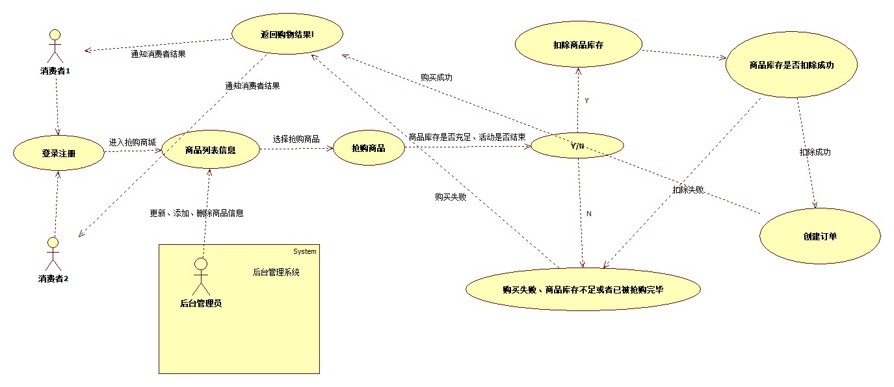

# 实验二：用例建模

##1.实验目标
 - 理解用例的概念；
 - 掌握用例图的画法；
 - 学习用例规约的写法。
 
##2.实验内容

 - 提交issue选题商品购物秒杀系统 #629
 - 确定该系统的功能需求
 - 使用StarUML画出用例图
 - 创建用例规约
 - 撰写实验报告二
 - 提交实验
 
##3.实验步骤

 - 确定选题：商品购物秒杀系统 # 629
	 - 细化功能需求
	 	- 1.抢购秒杀商品
	 	- 2.查询秒杀商品
 - 根据选题画出用例图
	 - 在starUML上创建一个商品购物系统
	 - 添加消费者用例
	 - 根据功能需求建出用例图
	 - 导出用例图
 - 填写用例规约
 - 将用例图和实验文档merge到本地仓库
 - 提交实验报告二
 
##4.实验结果

  

 	 图一：商品秒杀系统的用例图

## 表1：查看秒杀商品规约  

用例编号  | UC01 | 备注  
-|:-|-  
用例名称  | 查看秒杀商品  |   
前置条件  |    | *可选*   
后置条件  |    | *可选*   
基本流程  | 1. 消费者点击查看秒杀商品详情；  |*用例执行成功的步骤*    
~| 2. 系统显示秒杀商品详情页面；  |   
~| 3. 消费者输入商品名称，点击完成按钮；  |
~| 4. 系统检查商品名称不为空，查询商品信息。  |    
~| 5. 系统显示秒杀商品信息。  | 
扩展流程  | 4.1 系统检查发现商品名字为空，**提示“商品名称不能为空”**；  |*用例执行失败*   
扩展流程  | 4.2 系统检查发现商品信息不匹配，**提示“查无此商品”**；  |*用例执行失败*   *用例执行失败*   

## 表2：抢购秒杀商品

用例编号  | UC02 | 备注  
-|:-|-  
用例名称  | 抢购秒杀商品  |   
前置条件  | 消费者账号已登录    | *可选*   
后置条件  |   秒杀活动未结束且商品库存足够 | *可选*   
基本流程  | 1. 消费者点击**抢购商品**链接；  |*用例执行成功的步骤*    
~| 2. 系统检查消费者账号状态  |   
~| 3. 系统显示抢购秒杀商品信息页面  |   
~| 4. 系统**检查**秒杀商品库存、商品活动  |   
~| 5. 商品库存扣除成功，创建订单，提交订单   |  
扩展流程  | 2.1 系统检查发现消费者账号未登录，**提示“请登录账号”**；  |*用例执行失败*      
扩展流程  | 4.1 系统检查发现商品库存不足或活动已结束，**提示“商品库存不足或活动已结束”**；  |*用例执行失败*      

