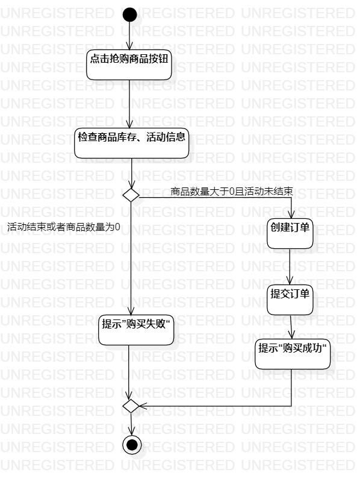

# 实验三：过程建模

##1.实验目标
 - 掌握过程建模方法
 - 掌握活动图的画法。（Activity Diagram）

##2.实验内容
- 根据实验2的用例规约内容来创建活动图

##3.实验步骤
 - 在StarUML中新建一个Activity Diagram
 - 创建Lab3_查看秒杀商品和Lab3_抢购秒杀商品两个活动图
 - 使用Activity Diagram 中的Toolbox工具建模
 - 添加initial和final
 - 添加action，并根据用例规约在action中输入不同的内容
 - 将建模图导出为jpg文件，
 - 填写实验报告三
##4.实验结果

 	 图一：查看秒杀商品活动图

  

 	 图二：抢购秒杀商品活动图
