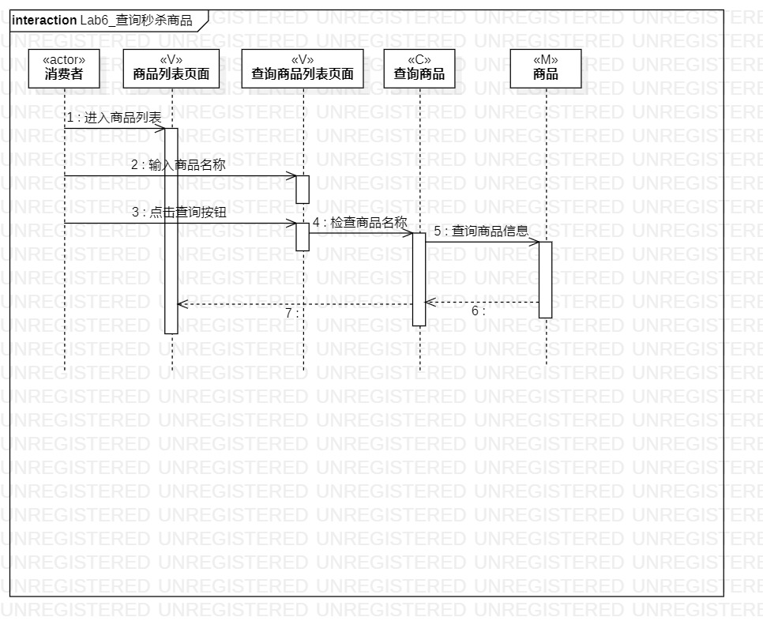
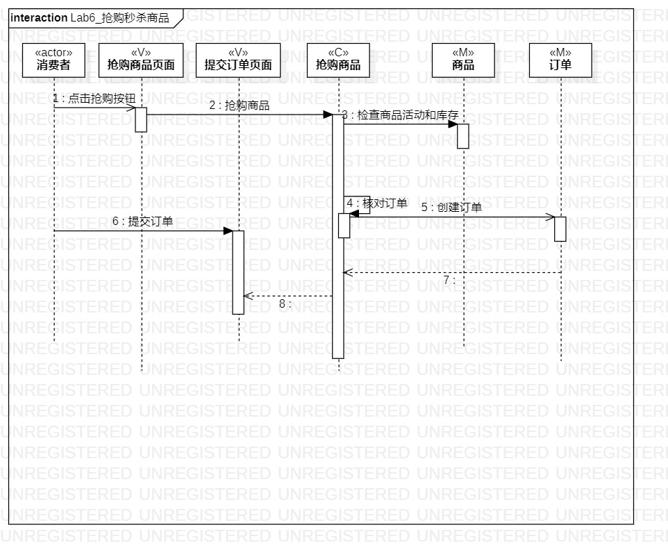

# 实验六：交互建模

## 1.实验目标
1. 理解系统交互；
2. 掌握UML顺序图的画法；
3. 掌握对象交互的定义与建模方法。

## 2. 实验内容
1. 根据用例模型和类模型，确定功能所涉及的系统对象；
2. 在顺序图上画出参与者（对象）；
3. 在顺序图上画出消息（交互）；

## 3. 实验步骤
1. 了解对象以及其画法；
2. 了解顺序图的构成、“时间顺序”的概念；
3. 了解顺序图的对象交互以及参与者的存活条；
4. 了解各种箭头对应的消息类型；
5. 从类图中找到以下参与者：
   #### 1. 查询商品
 <<actor>>消费者、<<V>>商品列表页面、<<V>>查询商品列表页面、<<C>>查询商品、<<M>>商品；
   #### 2. 抢购商品
  <<actor>>消费者、<<V>>抢购商品页面、<<V>>提交订单页面、<<C>>抢购商品、<<M>>商品、<<M>>订单；

6. 从活动图中提取出步骤；

## 四、实验结果

 	 图一：Lab6_查询秒杀商品

  

 	 图二：Lab6_抢购秒杀商品
