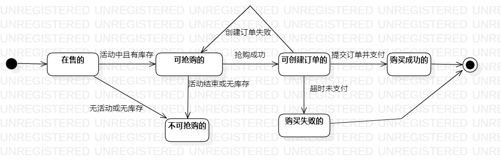

# 实验七：状态建模 #7

## 1.实验目标
1. 掌握对象状态建模（状态图，Statechart）。

## 2. 实验内容
1. 根据用例模型和类模型，确定功能所涉及的系统对象；
2. 在顺序图上画出参与者（对象）；
3. 在顺序图上画出消息（交互）；

## 3. 实验步骤
1. 确定主要对象为秒杀商品
2. 确定商品状态为：
 - 可抢购的
 - 不可抢购的
 - 可创建订单的
 - 购买失败的
 - 购买成功的
3. 在starUML创建一个状态图建模，并创建相应的对象和状态
4. 根据活动图等完善状态图

##4.实验要点

1.寻找一个关键的对象；
2.设计该对象的关键状态；

 - 对象的状态是：对象所表示的数据。如果数据发生变化，状态就是发生变化。
 - 描述状态：形容词。
 - 订单：- 可抢购的、不可抢购的、可创建订单的、购买失败的、购买成功的
##5.实验结果

 	 图一：Lab7_商品状态图

