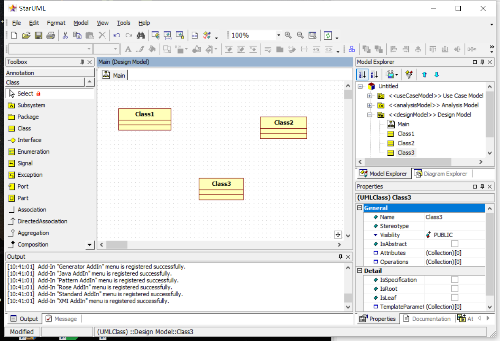

#实验一

##实验要求
 - 工具安装之后，打开并截图，保存在实验报告中；
 - 将个人选题及描述写在实验报告中，具体要求：
 - 选题标题为软件名称；
 - 描述中写出2-3个功能需求（不允许写“注册”和“登录”）；
 - 选题功能应该包含数据库的使用。
 - 实验报告将按照『教学助理』小程序的要求提交（此步骤延后）。
##实验步骤
- 下载安装StarUML和git
- 注册github账号
- fork老师的主库
- git clone文件到本地仓库
- 建立第一个UML模型图
- 使用git上传本地使用文件
- 再GitHub将git上的文件发送至老师仓库
##实验结果

   

 图一. 第一个UML建模图 