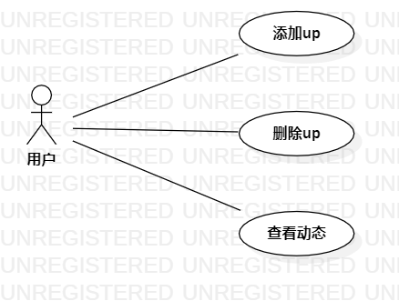

# 实验二：用例建模
## 1.实验目标
- 进一步熟悉git和staruml软件
## 2.实验内容
- 熟悉staruml的操作
- 熟悉git bash的操作
## 3.实验步骤
- 使用staruml画出用例图
- 使用git bash上传图片
- 使用markdown编写实验报告
## 4.实验结果

图1:B站UP主管理系统用例图

## 表1：添加up主用例规约  

用例编号  | UC01 | 备注  
-|:-|-  
用例名称  | 添加UP主  |   
前置条件  |  用户登录进入B站系统   | *可选*   
后置条件  |  用户进入添加UP主页面  | *可选*   
基本流程  | 1. 用户点击需要关注的UP主；  |*用例执行成功的步骤*   
~| 2. 系统显示UP主管理页面；  | 
~| 3. 用户点击关注按钮；  |
~| 4. 系统显示UP主关注成功页面；  |   
扩展流程  | 4.1 系统检查发现UP主已经关注，提示用户“已关注”。 |*用例执行失败*    

## 表2：删除UP主用例规约  

用例编号  | UC02 | 备注  
-|:-|-  
用例名称  | 删除UP主  |   
前置条件  |  用户登录进入B站系统   | *可选*   
后置条件  |  用户进入已关注UP主页面  | *可选*   
基本流程  | 1. 用户点击需要删除的UP主；  |*用例执行成功的步骤*    
~| 2. 系统显示UP主管理页面；  |   
~| 3. 用户点击取消关注按钮；  |   
~| 4. 系统显示UP主取消关注成功页面；  |   

## 表3：更新UP主动态用例规约  

用例编号  | UC03 | 备注  
-|:-|-  
用例名称  | 更新UP主动态  |   
前置条件  |  用户登录进入B站系统   | *可选*   
后置条件  |  用户进入已关注UP主页面  | *可选*   
基本流程  | 1. 用户点击需要查看动态的UP主；  |*用例执行成功的步骤*    
~| 2. 系统显示UP主管理页面；  |   
~| 3. 用户点击动态按钮；  |   
~| 4. 系统查询UP主动态信息； |   
~| 5. 系统显示UP主动态页面。  |  

