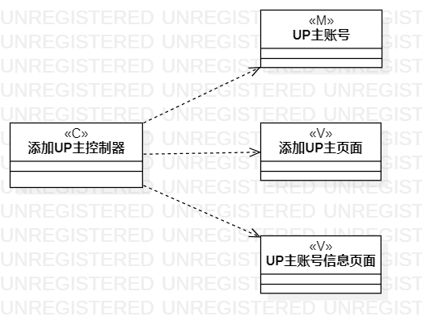
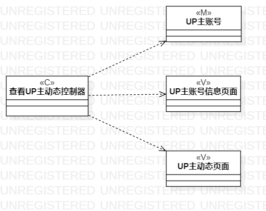

 # 实验四、五    类建模、高级类建模 

   ## 一、实验目标 

  ### 1.了解类建模基础概念； 
  ### 2.了解MVC架构的概念； 
  ### 3.掌握类图符号的正确运用。 

   ## 二、实验内容 

  ### 1. 了解MVC的概念
  ### 2. 根据用例规约绘制类图

   ## 三、实验步骤 

  ### 1. 根据用例规约找出模型类M，视图类V，控制类C
  ### 2. 找出模型类中的数据间关系
  ### 3. 根据MVC的关系连线

   ## 四、实验结果 
   图1：添加UP主类图          
    

   图2：删除UP主类图      
    

   图3：查看UP主动态类图    
    
