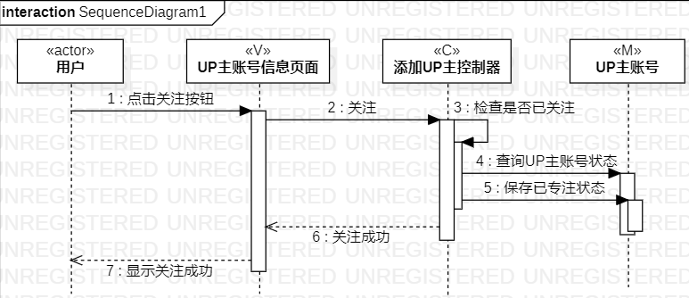
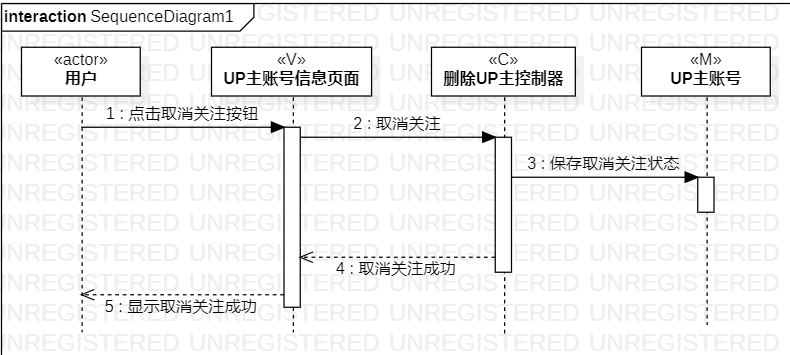
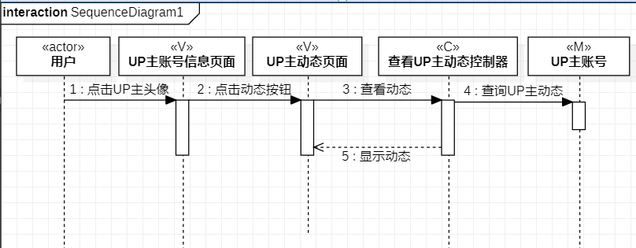

# 实验六交互建模

## 1.实验目标
- 理解系统交互
- 掌握UML顺序图的画法
- 掌握对象交互的定义与建模方法

## 2.实验内容
- 个人选题：#1068 b站UP主账号管理系统
- 选取用例：添加UP主，删除UP主，查看UP主动态
- 根据用例模型，类模型，确定功能所涉及的系统对象
- 在顺序图上画出参与者
- 在顺序图上划出消息

## 3.实验步骤
- 根据实验二的用例图，确定参与者和用例
- 根据实验三的活动图，确定消息的交互方式
- 根据实验四，五的类图，确定MVC结构
- 画出3个用例的顺序图

## 4.实验结果
图一：添加UP主顺序图       

图二：删除UP主顺序图       

图三：查看UP主动态顺序图    

