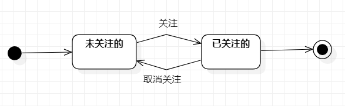

# 实验七：状态建模

## 一、实验目标

1. 掌握对象状态建模

## 二、实验内容

1、根据类图创建状态图

2、编写实验报告文档

## 三、实验步骤

1、在StarUML上创建状态图

2、绘制状态图

3、撰写实验七文档

## 四、实验要点

1. 寻找一个正确的对象

2. 设计该对象的关键状态

   · 对象的状态是：对象所表示的数据。如果数据发生变化，状态就是发生变化

   · 描述状态：形容词

3. 设计状态之间的转变条件

## 五、实验结果

											
