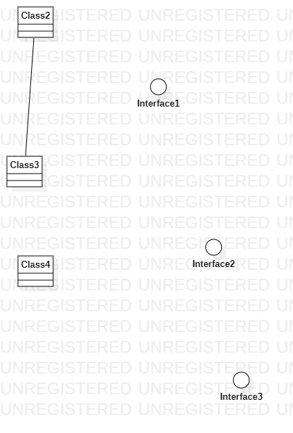

# 实验一
 
## 一、实验目标  
-学习Github的使用方法

-初步掌握StartUML的使用

## 二、实验内容  
-熟悉GitHub操作过程  

-安装git和StarUML  

-使用StartUML完成第一张UML图   

## 三、实验步骤  
-下载并安装所需要的软件

-建立第一份实验报告并完成

-建立第一张StartUML图

## 四、实验结果

图1：第一张UML图
