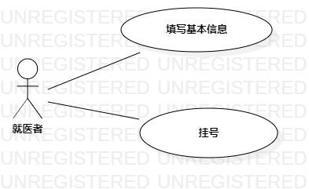

＃实验二：用例建模

## 1.实验目标
-完善选题，了解选题功能

-掌握用例图的画法

-掌握用例规约的编写

## 2.实验内容
-提交确定的选题和功能介绍

-完成相应选题的用例图

-编写实验报告

## 3.实验步骤
-提交选题  
-就诊系统

-确定参与人员  
-就医者

-确定系统的两个功能：  
  1）个人资料  
  2）挂号
  
-建立用例图  
1）增添Actor：患者  
2）增添UseCase：个人资料、挂号  
3）确定"就医者"和"个人资料"的关系  

-编写用例规约  
  1）个人资料用例规约   
  2）编写挂号用例规约  

## 4.实验结果

图1：就诊系统的用例

# 用例规约的编写

## 表1：填写基本信息用例规约  

用例编号  | UC01 | 备注  
-|:-|-  
用例名称  | 个人资料   |   
前置条件  |   | 
后置条件  |  系统显示挂号页面 | 
基本流程  | 1.就医者进入个人资料界面；  |
~| 3.就医者个人资料，点击提交按钮；   |  
~| 4.系统检测资料填写情况，检测资料填写符合要求；   | 
~| 4.系统保存就医者资料，显示“提交成功”；   | 
扩展流程~| 1.1 系统检测部分信息未填写或信息填写不符合要求，显示“信息填写错误，请重新填写！”；  |  

## 表2：挂号用例规约  

用例编号  | UC02 | 备注  
-|:-|-  
用例名称  | 挂号  |   
前置条件  |    成功提交基本信息  |    
后置条件  |      |   
基本流程  | 1.就医者选择科室、医生及就诊时间；  |
~| 2.就医者点击确认挂号按钮；  |   
~| 3.系统查询科室和医生信息，检测在该时间段内不存在挂号冲突的情况；  |   
~| 4.系统确认无挂号冲突情况，保存就医者选择，显示“挂号成功”；  | 
扩展流程  | 2.1 系统检测科室或医生在选择时间段内存在冲突情况，提示“挂号失败”  |
