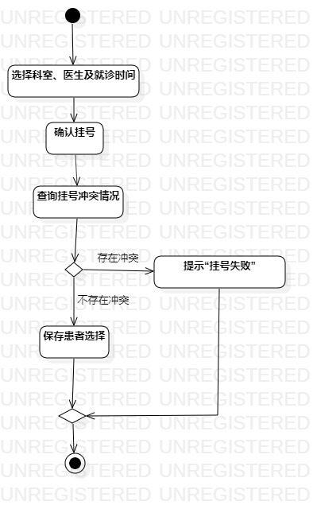

# 实验三：过程建模

## 一、实验目标
1. 掌握过程建模方法；
2. 掌握活动图的画法。（Activity Diagram）

## 二、实验内容
1. 使用StarUML根据用例规约画活动图  
-“个人资料”活动图  
-“挂号”活动图

## 三、实验步骤

1. 使用StarUML新建活动图    
2. 将用例规约的流程做成活动图  
（1）打开StarUML；  
（2）在Model Explore下：右键model -> Add Diagram -> Activity Diagram；  
（3）建立“个人资料”和“挂号”活动图；  
（4）在Toolbox的Classes(Basic)选择合适的工具绘图；  
3. 上传图片，完成实验文档

## 四、实验结果
  
图1：个人资料的活动图

  
图2：挂号的活动图
