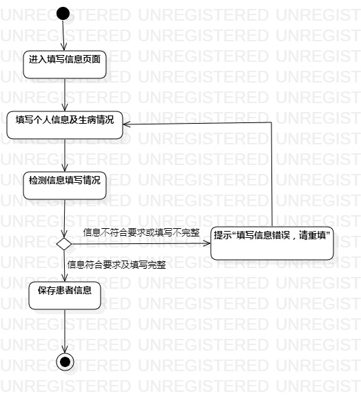

# 实验三：过程建模

## 一、实验目标
1. 掌握过程建模方法；
2. 掌握活动图的画法。（Activity Diagram）

## 二、实验内容
1. 使用StarUML根据用例规约画活动图  
-“填写基本信息”活动图  
-“挂号”活动图

## 三、实验步骤
1. 使用StarUML新建活动图  
2. 将用例规约的流程做成活动图  
3. 上传图片，完成实验文档

## 四、实验结果
  
图1：填写基本信息的活动图
