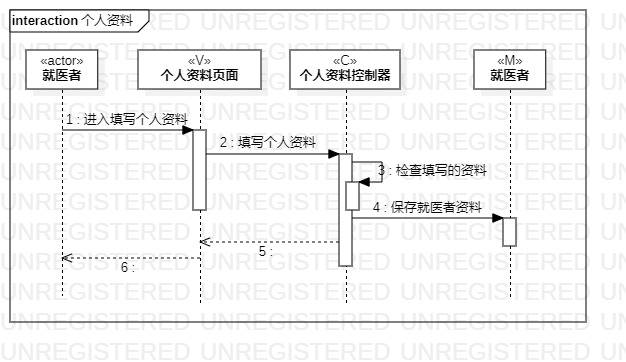
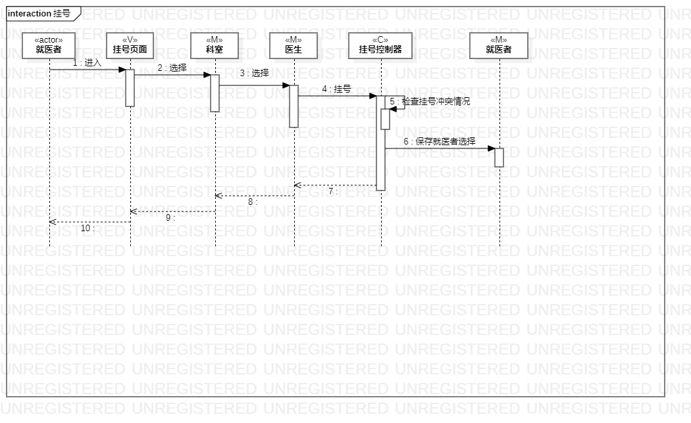

# 实验六：对象交互建模

### 一、实验目标
1.理解系统交互；  
2.掌握UML顺序图的画法；  
3.掌握对象交互的定义与建模方法。  

### 二、实验内容
1.根据用例模型和类模型，确定功能所涉及的系统对象；  
2.在顺序图上画出参与者（对象）；  
3.在顺序图上画出消息（交互）。  

 ### 三、实验步骤
 1.根据实验三的用例图找出第一个参与者，即actor（就医者）;  
 2.根据实验四五的类图中找出N个参与者，即C、V、M;  
 3.使用startUML工具，根据用例图画出顺序图；

### 四、实验结果

    
  
  图1.个人资料顺序图
  
    
  
  图1.挂号顺序图
  
