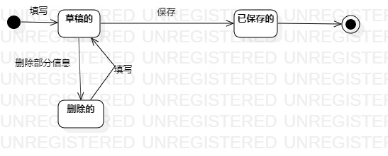

# 实验七：状态建模 

### 一、实验目标
 掌握对象状态建模（状态图，Statechart）。

### 二、实验内容
  1.根据用例图、活动图、类图、时序图来绘画状态图  
  2.编写实验报告文档

 ### 三、实验步骤
   1.寻找一个关键的对象   
     -对象：资料  
   2.设计该对象的关键状态  
    -对象的状态是：对象表示的数据。如果数据发生变化，状态就是发生变化    
    -描述状态：形容词  
    3.设计状态之间的转变条件  
 
 ### 四、实验结果
    
  
  图1.资料状态图
