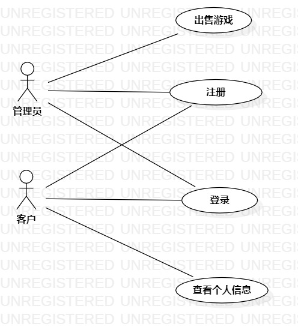

# 实验二：用例建模

## 1.实验目标
1.创建并完善选题

2.了解并掌握用例图的画法

3.通过github提交实验文档

## 2.实验内容
1.完成用例图的建模

## 3.实验步骤
1.先将所构思的系统画成草图
- 功能：
    - 商品管理
    - 出售游戏
2.再使用画图工具将系统用例图画出来
3.编写用例规约

## 4.实验结果

图一：道聚城商城系统的用例图

## 表1：商品管理用例规约  

用例编号  | UC01 | 备注  
-|:-|-  
用例名称  | 商品管理  |   
前置条件  |      | *可选*   
后置条件  |      | *可选*   
基本流程  ~| 1.管理员点击登录链接  |   *用例执行成功的步骤* 
~| 2. 管理员输入账号密码  | 
~| 3. 系统显示商品列表界面  |   
~| 4. 系统查询游戏库存，检查游戏库存数目，进入首页  |   
~| 5. 系统返回游戏列表  |    
扩展流程  | 4.1  系统检查发现库存不足 |*用例执行失败*    
~| 4.2 管理员增加库存  |  

## 表2：出售游戏用例规约  

用例编号  | UC02 | 备注  
-|:-|-  
用例名称  | 出售游戏 |   
前置条件  |      | *可选*   
后置条件  |      | *可选*   
基本流程  | 1.用户选中游戏，进行付款  |*用例执行成功的步骤*    
~| 2.系统判断用户是否付款  |   
~| 3. 系统将游戏加入用户游戏库  |   
~| 4.   |   
~| 5.   |  
扩展流程  | 2.1 系统发现用户未付款，提示“请再次付款”  |*用例执行失败*    
~| 2.2   |  

