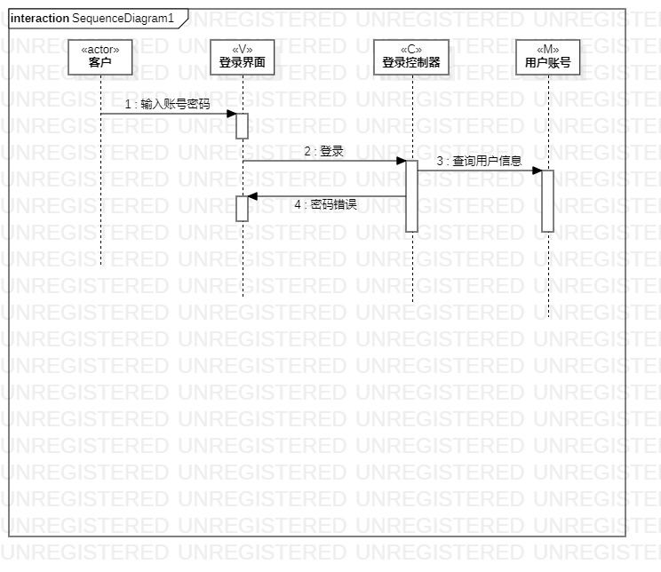
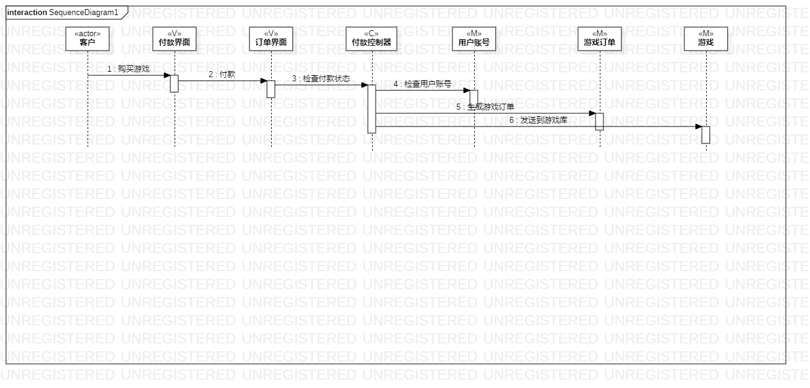

# 实验六: 交互建模
## 一、实验目标
- 理解系统交互；
- 了解对象的概念
- 掌握UML顺序图的画法；
- 掌握对象交互的定义与建模方法。
## 二、实验内容
- 根据用例模型和类模型，确定功能所涉及的系统对象；

   1.登录顺序图

   2.购买游戏顺序图

- 在顺序图上画出参与者（对象）；

- 在顺序图上画出消息（交互）

- 在顺序图上画出存活条（从上到下）

- 在顺序图上画出时间（从上到下）
## 三、实验步骤
- 在StarUml中创建顺序图
  1.登录
  2.购买游戏

- 从用例规约中的寻找参与者

- 根据类图中寻找类

- 根据活动图绘制消息、存活条和顺序

  1 消息：画在存活条上，从上到下代表时间顺序

  2 返回：从上到下代表时间顺序
## 四、实验结果

图1 登录顺序图

图2 购买游戏顺序图
