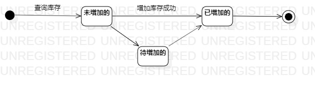
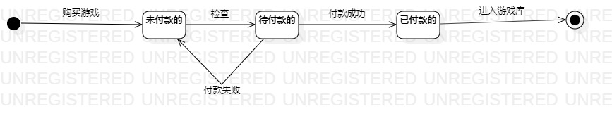

# 实验七: 状态建模

## 一、实验目标
- 理解对象状态；
- 掌握对象状态建模
- 掌握状态图的画法；

## 二、实验内容
- 根据根据用例图、用例规约、活动图、类图、顺序图与需求确定游戏商城的状态；

## 三、实验步骤
- 在StarUml中创建库存的状态图
   1.未增加的
   2.已增加的
   3.待增加的
   
- 在StarUml中创建付款的状态图
   1.未付款的
   2.已付款的
   3.代付款的

- 在状态图上绘制Inittial State与Final State

- 在状态图上绘制状态的转移条件

## 四、实验结果

图1 库存状态图

图2 付款状态图
