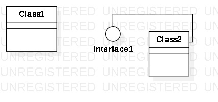

# 实验一

## 实验目标
## 一、实验目标

## 实验内容
1. 熟悉GitHub实验过程
2. 安装与使用StarUML

## 实验结果
## 二、实验内容

1. 安装GitHub并练习使用Git Bash
2. 安装StarUML并创建一个图

## 三、实验步骤

1. 下载并安装starUML和git
2. 建立并上传md文档和图片
3. GitHub上直接对md文档进行编辑
4. 提交请求到库

## 四、实验结果

1. 画图  
  
图1. StarUML上创建的第一个图
