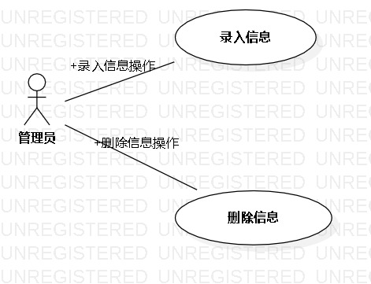

# 实验二：用例建模

## 1.实验目标
1.细化功能需求。

2.画出用例图（Use Case Diagram）。

3.编写用例规约（表格）。

## 2.实验内容
1.给每一个功能点写一段描述（字数至少60字，3行）。

2.写清楚使用功能的用户。

3.说明该功能执行之后产生的结果。

4.用例规约必填：基本流程（成功执行用例的步骤）；扩展流程（引起用例失败的步骤）。

## 3.实验步骤
1. 决定命题  
2. 东京奥运来访登记系统 
    使用功能的用户：  
    管理员 
    功能：  
    2.1 管理员录入来访人员信息  
    2.2 管理员删除来访人员信息
3. 将命题使用StarUML画一个示例图  
    3.1 用ACTOR创建管理员  
    3.2 再用椭圆创建功能  
    3.3 最后用线将他们连接在一起  
4. 给命题写用例规约  
    4.1 关于管理员将来访人员信息填入的用例规约  
    4.2 关于管理员将来访人员信息删除的用例规约  

## 3.实验结果
1. 画图  
  
图二 在StarUML创建的第二个图

2.用例规约：

## 表1：管理员录入来访人员信息用例规约  

用例编号  | RQ1 | 备注  
-|:-|-  
用例名称  | 录入来访人员信息  |   
前置条件  | 管理员已登录系统    | *可选*   
后置条件  |      | *可选*   
基本流程  | 1. 管理员点击录入按钮；  |*用例执行成功的步骤*    
~| 2. 系统显示录入来访人员信息页面；  |   
~| 3. 管理员输入姓名、性别、国籍，点击确定按钮；  |   
~| 4. 系统检查国籍存在，系统保存录入来访人员信息，并提示“录入来访人员信息成功”。  |   
~| 5.   |  
扩展流程  | 3.1 系统检查发现管理员录入的国籍不符合规范，**提示“国籍输入不正确”**；  |*用例执行失败*    
~|  |  

## 表2：管理员删除来访人员信息用例规约  

用例编号  | RQ2 | 备注  
-|:-|-  
用例名称  | 删除来访人员信息 |   
前置条件  | 管理员已登录系统    | *可选*   
后置条件  |      | *可选*   
基本流程  | 1. 管理员点击删除按钮；  |*用例执行成功的步骤*    
~| 2. 系统显示可删除的来访人员信息页面；  |   
~| 3. 管理员选择要删除的来访人员信息，点击删除按钮；  |   
~| 4. 系统检查信息是否锁定并删除所选来访人员信息，然后提示“删除来访人员信息成功”；  |   
~| 5.   |  
扩展流程  | 3.1 系统检查所选来访人员信息，信息不可删除，**提示“信息已锁定，不可删除”**；  |*用例执行失败*    
~|  |  
