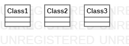

# 实验一：第一个文档

## 一、实验目标

1. 熟悉GitHub实验过程
2. 安装和使用StarUML

## 二、实验内容

- 安装GitHub并练习使用Git Bash
- 安装Star UML并创建一个图

## 三、实验步骤

1. 下载git工具及StarUML软件 
2. fork项目后，clone到本地磁盘  
3. 创建实验文档，用StarUML建立一个uml图，导出为图片  
4. 用Git Bash push到GitHub上  
5. 在github上编辑Markdown文档，并插入图片  
6. pull request，请求合并到主仓库

## 四、实验结果

1.画图

图1.在Star UML上创建的一个图
