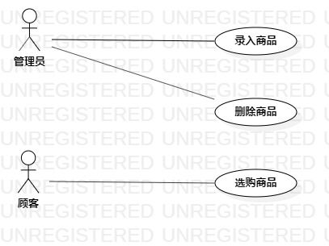

# 实验二：用例建模

## 一、实验目标

1. 掌握用例建模
2. 熟悉使用StarUML
3. 学会制定用例规约

## 二、实验内容

1. 确定系统功能需求
2. 画出用例图
3. 制定用例规约

## 三、实验步骤

1. 确定选题：网购商店系统
2. 确定参与者（Actor）:  
      - 管理员
      - 顾客
3. 确定用例（UserCase）:   
      - 录入商品
      - 删除商品
      - 选购商品
4. 绘制网购商店系统的用例图
5. 编写用例规约

## 四、实验结果

图1.网购商店系统的用例图

## 表1：录入商品用例规约  

用例编号  | UC01 | 备注  
-|:-|-  
用例名称  | 录入商品 |   
前置条件  | 管理员已登录 | *可选*   
后置条件  |    | *可选*   
基本流程  | 1. 管理员点击添加商品按钮；  |*用例执行成功的步骤*    
~| 2. 系统显示商品录入界面；  |   
~| 3. 管理员选择商品图片并输入商品名称，点击添加按钮；  |   
~| 4. 系统检查商品信息合格，保存商品图片和名称；  |   
~| 5. 系统提示“录入成功”。  |
扩展流程  | 4.1 系统检查发现商品图片不规范，提示“图片格式错误”；  |*用例执行失败*    
~| 4.2 系统检查发现商品信息重复，提示“商品已存在”。  |

## 表2：删除商品用例规约  

用例编号  | UC02 | 备注  
-|:-|-  
用例名称  | 删除商品 |   
前置条件  | 管理员已登录 | *可选*   
后置条件  |    | *可选*   
基本流程  | 1. 管理员点击删除商品按钮；  |*用例执行成功的步骤*    
~| 2. 系统显示商品删除界面；  |   
~| 3. 管理员输入要删除的商品名称，点击确认按钮；  |   
~| 4. 系统查询商品信息，商品存在，删除该商品；  |   
~| 5. 系统提示“删除成功”。  |
扩展流程  | 4.1 系统查询不到商品信息，提示“该商品不存在，删除失败” |*用例执行失败*    

## 表3：选购商品用例规约  

用例编号  | UC03 | 备注  
-|:-|-  
用例名称  | 选购商品 |   
前置条件  | 买家已经登录，并找到想买的商品 | *可选*   
后置条件  |    | *可选*   
基本流程  | 1. 顾客选择规格、购买数量，点击购买按钮；  |*用例执行成功的步骤*    
~| 2. 系统检查订单信息合格，创建并保存订单记录；  |   
~| 3. 系统显示下单成功。  |
扩展流程  | 2.1 系统检查发现购买数量小于0，提示“数量不对”；  |*用例执行失败*    
~| 2.2 系统检查发现购买数量大于库存量，提示“库存不够”。  |  
