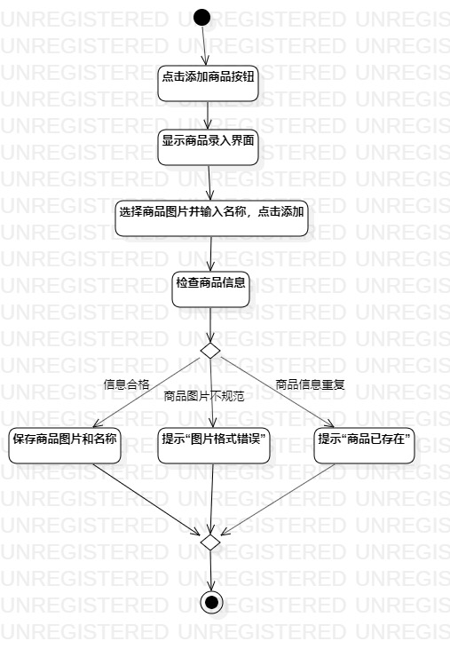
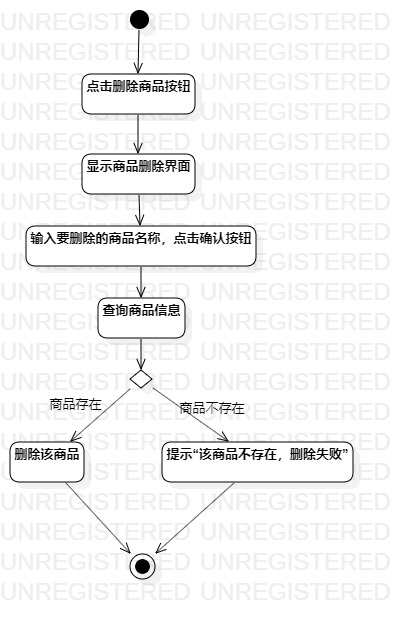
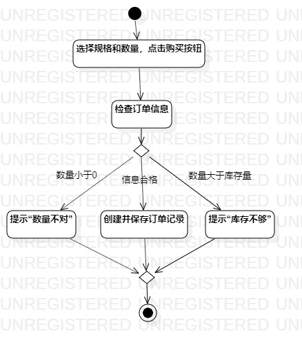

# 实验三：过程建模
## 一、实验目标

1. 掌握过程建模方法；
2. 掌握活动图的画法。

## 二、实验内容

1. 学习活动图画法，利用StarUML画出活动图
2. 提交实验报告并将图片显示在PR中

## 三、实验步骤

1. 通过视频学习活动图的画法
2. 利用StarUML分别画出录入商品、删除商品、选购商品的活动图
  - 添加initial和final
  - 根据用例规约添加action
  - 在有扩展流程时添加decision
  - 用control flow连接起来
  - 调整各部分位置尽可能简洁美观
3. 将图片导出到个人文件夹中，并git push
4. 创建lab3.md文件并编写实验报告，将图片插入报告中
5. 在PR页面插入三个活动图，然后pull request
6. 在Git Bash中执行git pull命令

## 四、实验结果

  
图1：录入商品活动图

  
图2：删除商品活动图

  
图3：选购商品活动图
