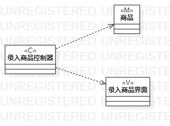
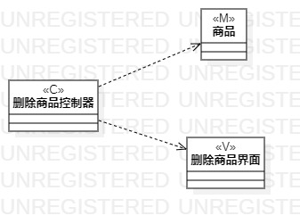
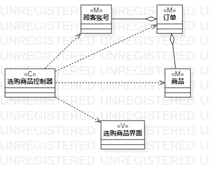

# 实验四、五：类建模
## 一、实验目标

1. 掌握类建模方法
2. 了解MVC设计模式
3. 掌握类图的画法
4. 理解类的5种关系
5. 掌握类之间关系的画法

## 二、实验内容

1. 学习类图概念
   - 类与类
   - 类与关系
2. 学习类图画法
3. 根据三个用例画出类图

## 三、实验步骤

1. 通过视频学习类图的画法，并做上课笔记：
 - 类的画法：矩形=名称+属性+操作（属性和操作可选）
 - 类的关系：关系弱的耦合性低，较常用
 - 基于MVC模式设计类
2. 利用StarUML分别画出录入商品、删除商品、选购商品的类图，画图要点：
 - 从用例规约中的基本流程和扩展流程中寻找类；
 - 给系统操作设计业务服务类
 - 有多少个用例，画多少个类图
3. 将图片导出到个人文件夹中，并git push
4. 创建lab4.md文件并编写实验报告，将图片插入报告中
5. 在PR页面插入三个活动图，然后pull request

## 四、实验结果

  
图1：录入商品类图

  
图2：删除商品类图

  
图3：选购商品类图
