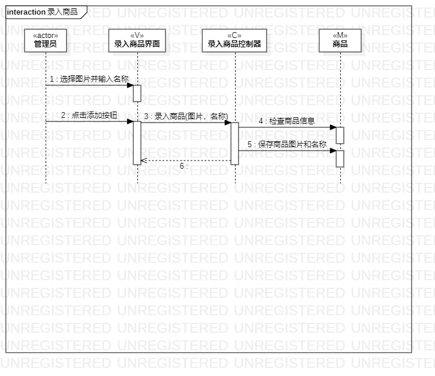
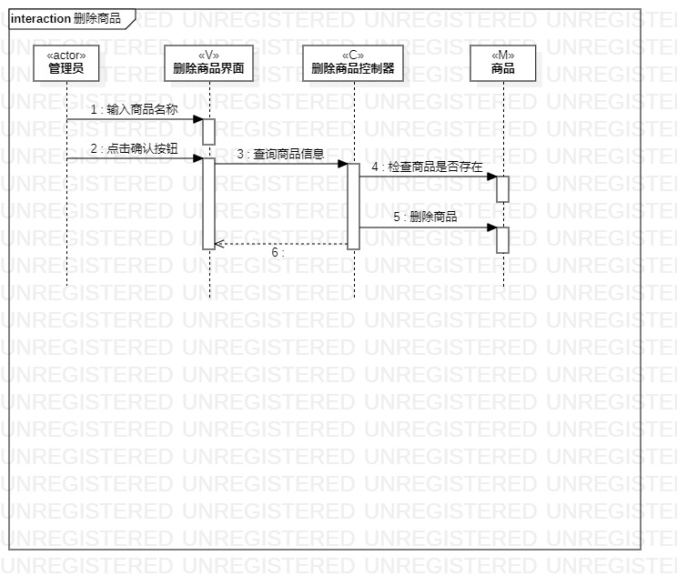
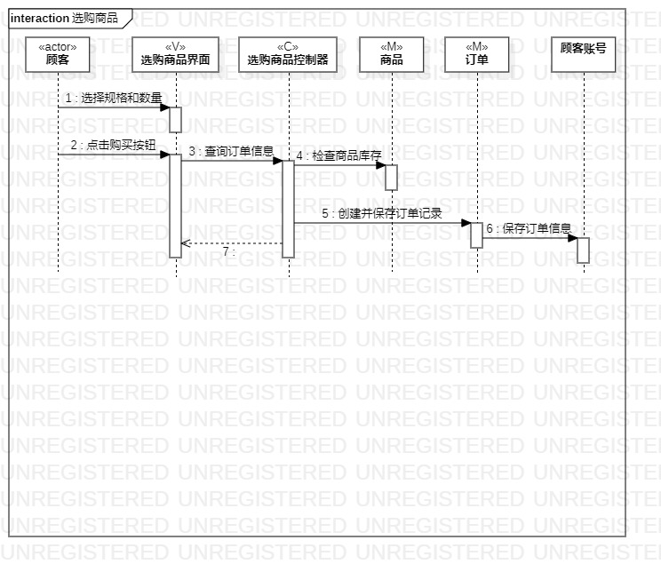

# 实验六：交互建模
## 一、实验目标

1. 理解系统交互；
2. 掌握UML顺序图的画法；
3. 掌握对象交互的定义与建模方法。

## 二、实验内容

1. 根据用例模型和类模型，确定功能所涉及的系统对象；
2. 在顺序图上画出参与者（对象）；
3. 在顺序图上画出消息（交互）。

## 三、实验步骤

1. 通过视频学习顺序图的画法，并做上课笔记
2. 利用StarUML分别画出录入商品、删除商品、选购商品的顺序图，画图要点：
  - 从用例图找到第一个参与者（actor）
  - 从类图找到N个参与者，总共1+N个参与者
  - 从活动图找到操作步骤，画出参与者之间的消息
3. 将图片导出到个人文件夹中，并git push
4. 创建并编写实验报告，将图片插入报告中
5. 在PR页面插入三个活动图，然后pull request

## 四、实验结果

  
图1：录入商品顺序图

  
图2：删除商品顺序图

  
图3：选购商品顺序图
