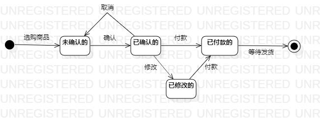

# 实验七：状态建模
## 一、实验目标

1. 掌握对象状态建模（Statechart）

## 二、实验内容

1. 根据用例图、活动图、类图、时序图来绘画状态图;
2. 编写实验报告文档。

## 三、实验步骤

1. 通过视频学习状态图的画法，并做笔记
2. 确定对象，利用StarUML画出订单状态图，画图要点：
  - 寻找一个重要的对象
  - 寻找这个对象的所有重要状态
  - 画出状态之间的转变条件
3. 将图片导出到个人文件夹中，并git push
4. 创建并编写实验报告，将图片插入报告中
5. 在PR页面插入三个活动图，然后pull request

## 四、实验结果

  
图1：订单状态图
